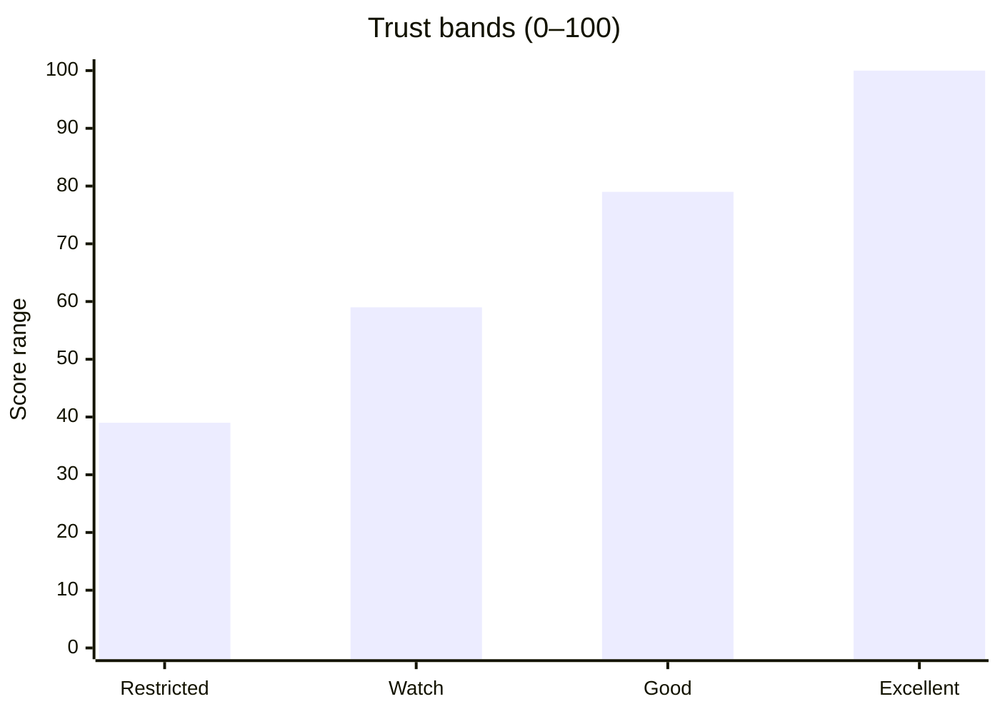
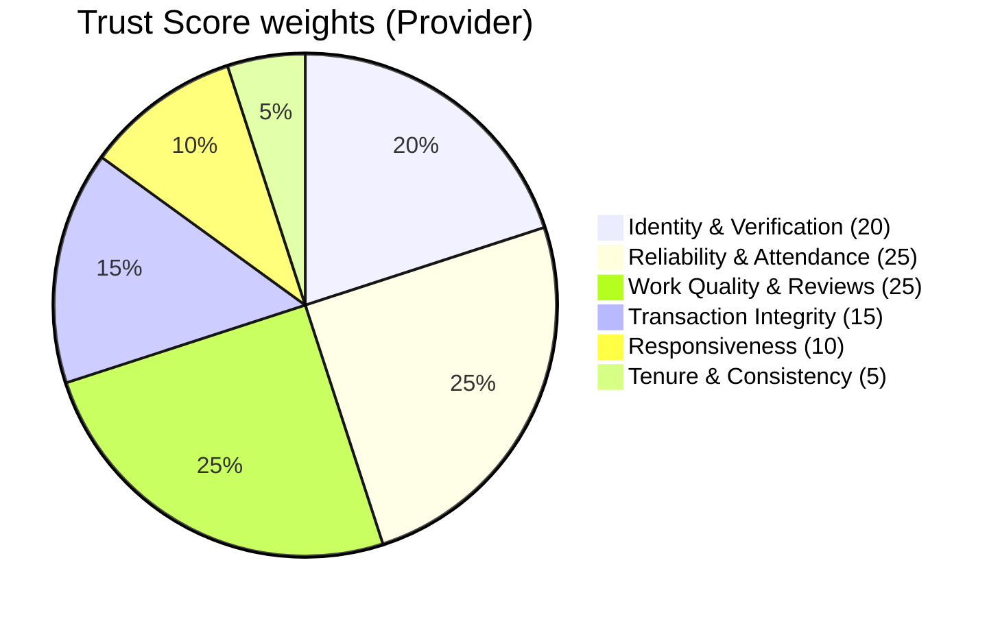
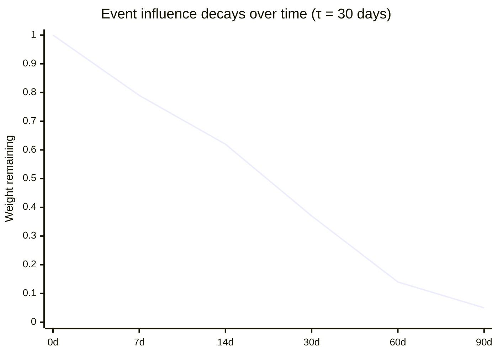
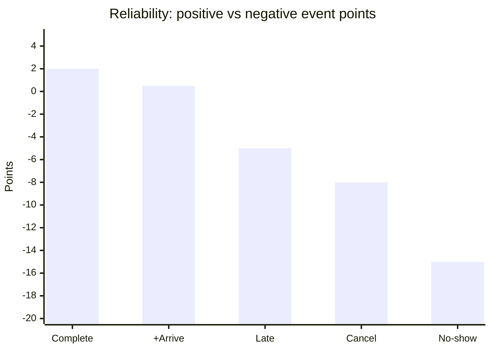
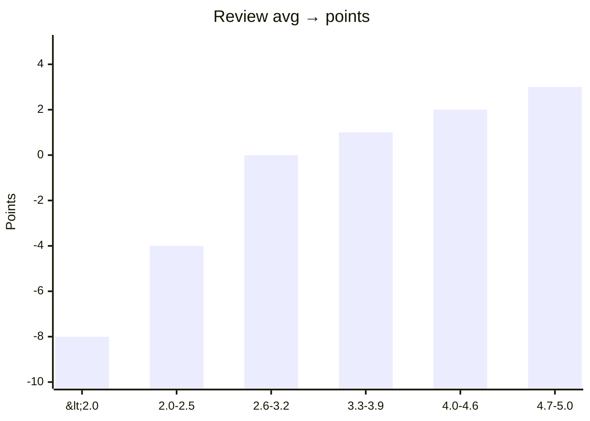
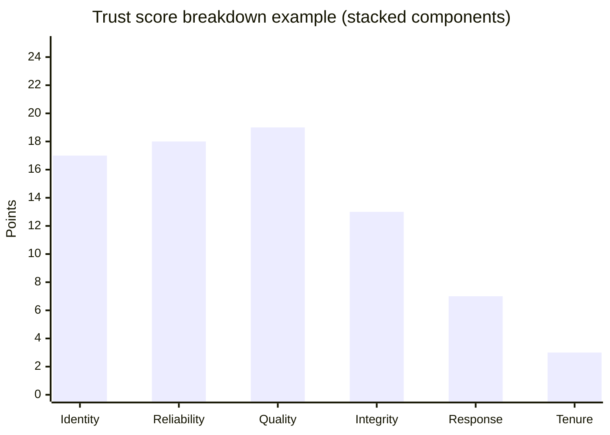
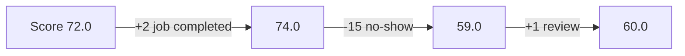

# LocalLink Trust Score (V2) — Implementation Blueprint

This document is a **code-ready spec** for a production-grade Trust Score system:

- **Database schema** (event ledger + snapshots)
- **Backend services/APIs** (compute + explanations)
- **Admin UI** (breakdowns, trends, interventions)
- **Charts/graphs** (for product + admin alignment)

It is designed to be explainable, enforceable, and Ghana-realistic.

---

## Goals

- **Trust = risk + reliability**, not “star rating”.
- Make trust **actionable** (drives ranking + gates + alerts).
- Make trust **auditable** (admin can see exactly why).
- Avoid score farming (caps + decay + severe penalties).

---

## Score definition

- **Public scale**: 0–100
- **Internal storage**: 0..1 in `users.trust_score` (optional), or store as 0–100 in snapshots and map.

### Trust bands

- **Excellent**: 80–100
- **Good**: 60–79
- **Watch**: 40–59
- **Restricted**: 0–39



---

## Component weights (sum = 100)



---

## Event ledger + decay model

We store “trust-relevant events” and compute a score using **time decay**.

### Decay

For each event \(i\) with points \(p_i\) and age \(\Delta t_i\) in days:

\[
E = \sum_i p_i \cdot e^{-\Delta t_i / \tau}
\]

Recommended \(\tau\): **30 days**.



### Saturating mapping (anti-farming)

Convert decayed evidence into a component score using a saturating function:

\[
C = W \cdot \sigma(E / k), \quad \sigma(x)=\frac{1}{1+e^{-x}}
\]

- \(W\) = component weight (e.g. 25)
- \(k\) = sensitivity, recommended **6–10** depending on component volatility.

---

## Recommended Postgres schema

### 1) `trust_events` (ledger)

Stores events that affect trust with **explicit component attribution**.

```sql
create table if not exists trust_events (
  id uuid primary key default gen_random_uuid(),
  user_id uuid not null references users(id) on delete cascade,
  actor_user_id uuid references users(id) on delete set null, -- who caused it (buyer/admin/system/provider)
  component text not null, -- identity|reliability|quality|integrity|responsiveness|tenure
  kind text not null,      -- e.g. job_completed, no_show, dispute_lost, off_platform_link, review_5star
  points numeric(8,2) not null, -- +/- points in the component’s native unit
  meta jsonb,              -- evidence references, context ids, etc.
  occurred_at timestamptz not null default now(),
  created_at timestamptz not null default now()
);

create index if not exists trust_events_user_time_idx on trust_events(user_id, occurred_at desc);
create index if not exists trust_events_component_time_idx on trust_events(component, occurred_at desc);
create index if not exists trust_events_kind_time_idx on trust_events(kind, occurred_at desc);
```

### 2) `trust_snapshots` (latest computed state)

Keeps a materialized view for fast reads and admin dashboards.

```sql
create table if not exists trust_snapshots (
  user_id uuid primary key references users(id) on delete cascade,
  score_100 numeric(5,2) not null default 0,
  band text not null default 'restricted',
  components jsonb not null default '{}'::jsonb, -- per-component breakdown + evidence
  computed_at timestamptz not null default now()
);

create index if not exists trust_snapshots_band_idx on trust_snapshots(band);
create index if not exists trust_snapshots_computed_at_idx on trust_snapshots(computed_at desc);
```

### 3) Optional `trust_snapshot_history` (trend lines)

If you want charts over time:

```sql
create table if not exists trust_snapshot_history (
  id bigserial primary key,
  user_id uuid not null references users(id) on delete cascade,
  score_100 numeric(5,2) not null,
  band text not null,
  components jsonb not null,
  computed_at timestamptz not null default now()
);

create index if not exists trust_snapshot_history_user_time_idx on trust_snapshot_history(user_id, computed_at desc);
```

---

## Canonical point events (v1)

### Reliability events (high penalty)



### Review mapping (structured → points)



---

## Backend services

### 1) `recordTrustEvent()`

Write ledger entries from:
- job completion
- no-show confirmed
- dispute resolved
- off-platform policy event
- review created (verified only)

Responsibilities:
- validate component/kind
- attach context ids in `meta`
- enforce caps (e.g., max +6 quality points per 30 days)

### 2) `computeTrustSnapshot(userId)`

Steps:
- Load identity signals (Ghana ID verified, verification tier, phone verified).
- Aggregate events per component with decay.
- Compute each component score using \(C=W\sigma(E/k)\).
- Sum components → score_100.
- Map score_100 → band.

Output shape (example):

```json
{
  "score_100": 76.4,
  "band": "good",
  "components": {
    "identity": { "weight": 20, "score": 16.8, "signals": ["Ghana ID verified", "Phone verified"] },
    "reliability": { "weight": 25, "score": 18.2, "signals": ["12 completions (90d)", "0 no-shows (90d)"] },
    "quality": { "weight": 25, "score": 19.1, "signals": ["Rating 4.6", "Verified reviews"] },
    "integrity": { "weight": 15, "score": 12.7, "signals": ["No off-platform violations (30d)"] },
    "responsiveness": { "weight": 10, "score": 7.0, "signals": ["Active this week"] },
    "tenure": { "weight": 5, "score": 2.6, "signals": ["Account age 120d"] }
  }
}
```

### 3) Worker job: `recomputeTrustSnapshots`

Run on:
- nightly schedule (ideal)
- or “best-effort every X minutes” for early-stage

Batch strategy:
- only users active in last N days
- only provider roles (artisan/farmer/driver) initially

---

## API endpoints

### User-facing (simple)

- `GET /api/trust/me`
  - returns: score, band, top 3 “why”, and how-to-improve actions

### Admin (full breakdown)

- `GET /api/trust/admin/users/:id`
  - returns: full components, raw signals, event summaries

### Optional: snapshot & history endpoints

- `GET /api/admin/trust/snapshots?band=watch&limit=100`
- `GET /api/admin/trust/users/:id/history?days=30`

---

## Admin UI: Trust Breakdown (charts)

### A) Component bar chart (stacked)



### B) “What changed” waterfall

Admin needs to see the last 7 days of events that moved the score.



### C) Interventions (playbooks)

For each band:
- **Restricted**: freeze acceptance / require reverification / cooldown
- **Watch**: throttle visibility / warning / require confirmation
- **Good/Excellent**: ranking boosts, faster auto-release rules

---

## Implementation sequencing (recommended)

1. **Snapshot + breakdown UI** (no behavior changes yet)
2. **Ranking integration** (match uses snapshot score)
3. **Gates + consequences** (withdrawals/quoting)
4. **Alerts** (ops early-warning system)

